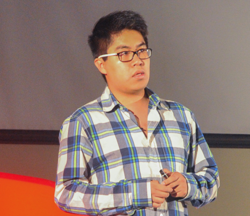

#Hello, this is Eduardo Blancas Reyes

</img>

I'm a Mechatronics Engineer (that's what my diploma says) raised in Mexico City. I've been doing iOS development for a while and now I turned to Data Science. I enjoy applying my technical skills to problems with social impact.

Like the time that I helped to [stop a 9.3 million fraud](http://techcrunch.com/2013/04/14/bringing-down-the-mexican-mafia-how-mexican-hackers-stopped-a-93-million-fraud/). Or when I tried to understand the [causes of home abandonment in Mexico](http://dssg.uchicago.edu/2015/08/13/infonavit-abandonment.html) with a team full of smart people.

##What's the internet saying about me?

These are some links that talk about my work...

[DSSG 2015 Profile](http://dssg.io/2015/05/12/profiles-blancas-giraudy.html)

[ITESM News](http://www.itesm.mx/wps/wcm/connect/snc/portal+informativo/por+tema/politica/app115_14jun13)

[World Bank Press Release](http://www.bancomundial.org/es/news/press-release/2013/08/20/winners-innovation-transparency-prize-third-edition)

[LabCDMX](http://labplc.mx/hackdf-2/)

[More on Home abandonment in Mexico](http://dssg.uchicago.edu/2000/03/02/org-infonavit.html)

[Me, giving a TED talk](https://www.youtube.com/watch?v=OYhnkOPG874)

##Contact

I sometimes write in [Medium](https://medium.com/@edublancas), but I'm always [tweeting](https://twitter.com/edublancas). If you want to talk about work, check out my [LinkedIn profile](https://mx.linkedin.com/in/edublancas) or download mi [CV](cv.pdf). I have some videos on [YouTube](https://www.youtube.com/user/edublancas/videos)